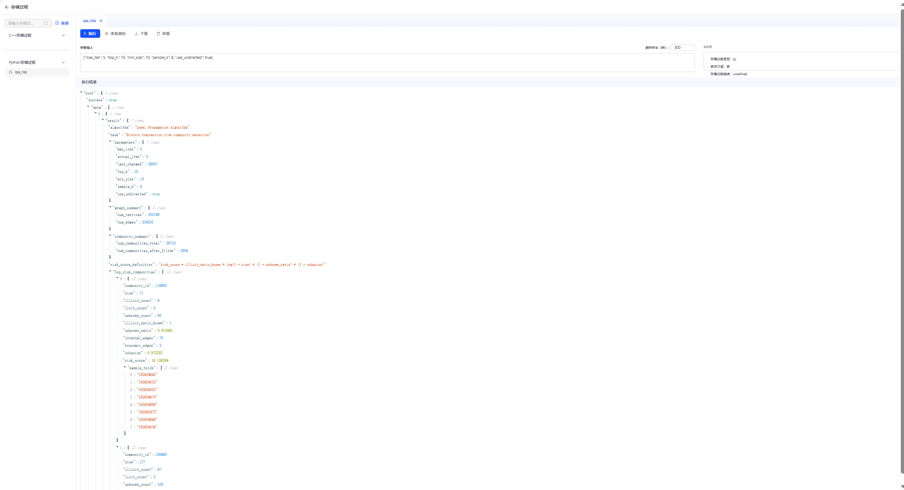
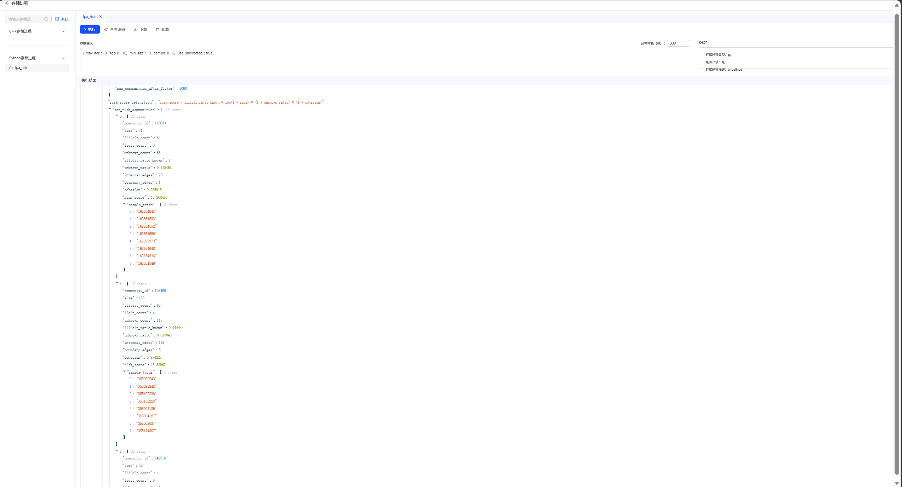

# 基于 LPA 的比特币交易网络风险社区识别

## ——面向链上反洗钱的 TuGraph 社区检测实验

## 1. 实验背景与问题设计

### 1.1 实验背景

区块链交易数据天然具有网络结构。一笔交易并不是孤立存在的，而是通过资金流向与其他交易形成连接关系。在比特币交易网络中，交易节点之间可能存在资金拆分、资金汇聚、中转传递等复杂关系。传统表格数据虽然能够记录交易编号和交易类别，但难以直接揭示交易之间形成的团簇结构和风险传播关系。

本实验基于课程提供的 Elliptic++ Transactions Dataset，使用 TuGraph 图数据库构建比特币交易网络，并在该网络上运行标签传播算法（Label Propagation Algorithm, LPA），识别交易网络中的风险社区。实验目标不是简单查询单笔交易，而是尝试回答一个更具有实际意义的问题：

> 在比特币交易网络中，能否利用社区检测算法，从交易连接结构中识别出与已知非法交易联系紧密、且包含大量未知交易节点的高风险交易团簇？

### 1.2 研究问题

本实验将比特币交易关系建模为图结构：

```text
(Transaction)-[:Flow_to]->(Transaction)
```

其中，`Transaction` 表示一笔比特币交易，`Flow_to` 表示资金从一笔交易流向另一笔交易。

基于该图模型，本文提出如下研究问题：

> 在不直接使用交易类别标签参与社区划分的前提下，能否仅根据交易网络结构识别出潜在风险社区，并进一步结合交易类别标签对社区风险进行解释？

该问题具有较强的现实意义。在链上反洗钱分析中，风险交易往往不是孤立出现的，而是可能与一组未知交易或中转交易形成交易团簇。如果某一社区中存在已知非法交易，同时还包含大量 `unknown` 交易，则这些未知交易可能具有进一步审查价值。

### 1.3 实际意义

本实验的实际意义主要体现在三个方面。

第一，实验将图数据库用于区块链交易网络分析。相比传统表格数据，图数据库可以更自然地表达交易之间的资金流向关系，并支持基于路径、社区和中心性的图分析。

第二，实验使用 LPA 社区检测方法识别交易团簇。LPA 能够从网络结构出发，将连接较为紧密的交易节点划分到同一社区中。对于比特币交易网络而言，这有助于识别资金流动中的局部结构。

第三，实验进一步构造社区风险评分，将社区检测结果转化为链上风险筛查线索。需要注意的是，风险评分不是最终定性结论，而是用于辅助识别值得进一步人工复核或机器学习建模的候选社区。

---

## 2. 实验原理

### 2.1 社区检测

社区检测算法用于识别图中连接较为紧密的节点组。一个社区内部的节点往往具有较多连接，而社区之间的连接相对较少。在社交网络中，社区可能代表兴趣相近的用户群体；在交易网络中，社区则可能代表资金流关系较为紧密的一组交易节点。

在区块链交易网络中，社区检测具有特殊意义。若某一社区内部同时包含已知非法交易和大量未知交易，则这些未知交易可能与非法交易存在结构关联，具有进一步筛查价值。

### 2.2 标签传播算法 LPA

标签传播算法（Label Propagation Algorithm, LPA）是一种典型的社区检测算法。其基本思想是：

1. 初始状态下，每个节点拥有一个独立标签；
2. 在每一轮迭代中，节点观察其邻居节点的标签；
3. 节点选择邻居中出现频率最高的标签作为自己的新标签；
4. 在连接密集的区域，同一标签会快速传播并占据主导；
5. 当标签趋于稳定后，拥有相同标签的节点被划分为同一社区。

本实验在 `Transaction` 节点与 `Flow_to` 边构成的交易网络上运行 LPA。由于原始 `Flow_to` 边表示资金流方向，而社区检测更关注节点之间是否存在紧密连接，因此实验在社区划分阶段默认将有向资金流关系转化为弱无向连接。这样处理并不否定资金流方向，而是将“存在资金流关系”的交易视为结构上相关的节点。资金流方向仍然可以在后续局部子图可视化中观察。

### 2.3 本实验的风险社区识别思路

本实验的关键设计是：**LPA 社区划分过程只使用图结构，不使用 `tx_class` 参与社区划分。**

具体而言，算法首先只根据 `Transaction` 节点和 `Flow_to` 边进行标签传播，得到交易社区；随后再统计每个社区中的 `1`、`2` 和 `unknown` 交易节点数量，并计算风险评分。

这种设计可以避免直接按照交易标签划分社区，使实验具有无监督结构发现的含义。`tx_class` 的作用是对社区检测结果进行解释，而不是参与社区生成过程。

### 2.4 社区风险评分设计

为了从大量社区中筛选出值得重点关注的交易团簇，本实验设计如下社区风险评分：

```text
risk_score = illicit_ratio_known × log(1 + size) × (1 + unknown_ratio) × (1 + cohesion)
```

其中：

| 指标                    | 含义                           |
| --------------------- | ---------------------------- |
| `illicit_ratio_known` | 已知类别交易中非法交易占比，反映社区中已知风险信号的强度 |
| `size`                | 社区规模，反映该社区潜在影响范围             |
| `unknown_ratio`       | 社区中未知类别交易占比，反映进一步筛查价值        |
| `cohesion`            | 社区内部连接边占相关边的比例，反映社区内部连接紧密程度  |

该评分不是法律意义上的风险判定，而是一个结构化筛查指标。风险评分越高，说明该社区越值得被优先关注。

---

## 3. 实验数据与图模型

### 3.1 数据集说明

本实验使用课程提供的 Elliptic++ Transactions Dataset，主要包括两个 CSV 文件：

| 文件名                         | 主要字段             | 含义            |
| --------------------------- | ---------------- | ------------- |
| `elliptic_txs_classes.csv`  | `txId`, `class`  | 记录交易节点编号及其类别  |
| `elliptic_txs_edgelist.csv` | `txId1`, `txId2` | 记录交易之间的资金流向关系 |

其中，`class = 1` 表示已知非法交易，`class = 2` 表示已知合法交易，`unknown` 表示未知类别交易。

### 3.2 图模型设计

本实验将比特币交易网络建模为一张有向图。

| 图元素 | 名称            | 含义               |
| --- | ------------- | ---------------- |
| 点类型 | `Transaction` | 表示一笔比特币交易        |
| 边类型 | `Flow_to`     | 表示资金从一笔交易流向另一笔交易 |

`Transaction` 节点的主要属性包括：

| 属性名        | 含义   |
| ---------- | ---- |
| `txid`     | 交易编号 |
| `tx_class` | 交易类别 |

`Flow_to` 边的方向为：

```text
Transaction(txId1) -> Transaction(txId2)
```

也就是说，如果边数据中存在 `txId1, txId2`，则表示资金从交易 `txId1` 流向交易 `txId2`。

---

## 4. 实验步骤

### 4.1 新建图项目

首先在 TuGraph 平台中新建图项目，用于存储本次实验的比特币交易网络数据。

<p align="center">
  
</p>
<p align="center"><b>图1 新建 TuGraph 图项目</b></p>

### 4.2 图模型构建

随后在图构建页面中创建 `Transaction` 点类型和 `Flow_to` 边类型。其中，`Transaction` 用于表示交易节点，`Flow_to` 用于表示交易之间的资金流向关系。

<p align="center">
  
</p>
<p align="center"><b>图2 Transaction 节点与 Flow_to 边的图模型</b></p>

### 4.3 导入交易节点数据

首先导入 `elliptic_txs_classes.csv`，并将其映射为 `Transaction` 节点。其中，`txId` 映射为 `txid`，`class` 映射为 `tx_class`。

<p align="center">
  
</p>
<p align="center"><b>图3 点数据导入配置</b></p>

<p align="center">
  
</p>
<p align="center"><b>图4 点数据导入成功</b></p>

### 4.4 导入资金流向边数据

随后导入 `elliptic_txs_edgelist.csv`，并将其映射为 `Flow_to` 边。其中，`txId1` 映射为起点交易编号，`txId2` 映射为终点交易编号。

<p align="center">
  
</p>
<p align="center"><b>图5 边数据导入配置</b></p>

<p align="center">
  
</p>
<p align="center"><b>图6 边数据导入成功</b></p>

### 4.5 检查交易节点

数据导入完成后，首先使用 Cypher 检查 `Transaction` 节点是否成功导入。

```cypher
MATCH (t:Transaction)
RETURN t
LIMIT 10;
```

<p align="center">
  
</p>
<p align="center"><b>图7 Transaction 交易节点检查</b></p>

### 4.6 检查资金流向边

继续使用 Cypher 检查 `Flow_to` 边是否成功导入。

```cypher
MATCH p = (a:Transaction)-[:Flow_to]->(b:Transaction)
RETURN p
LIMIT 10;
```

<p align="center">
  
</p>
<p align="center"><b>图8 Flow_to 资金流向边检查</b></p>

### 4.7 上传 LPA 存储过程

本实验通过 TuGraph 的 Python 存储过程机制实现 LPA 社区检测与风险评分。存储过程以只读方式访问图数据，遍历交易节点和资金流向边，并返回风险评分排名靠前的社区。

<p align="center">
  
</p>
<p align="center"><b>图9 上传 LPA 风险社区检测存储过程</b></p>

### 4.8 测试运行 LPA

为验证存储过程能够正常读取图数据并返回结果，首先使用较小参数进行测试：

```json
{"max_iter": 1, "top_k": 3, "min_size": 20, "sample_k": 5, "use_undirected": true}
```

<p align="center">
  
</p>
<p align="center"><b>图10 LPA 测试运行结果</b></p>

测试结果显示，存储过程能够成功读取图数据并输出风险社区结果，说明插件运行正常。

### 4.9 正式运行 LPA

测试成功后，使用正式参数运行 LPA：

```json
{"max_iter": 10, "top_k": 10, "min_size": 10, "sample_k": 8, "use_undirected": true}
```

参数含义如下：

| 参数               | 含义                | 本实验设置 |
| ---------------- | ----------------- | ----- |
| `max_iter`       | 最大迭代次数            | 10    |
| `top_k`          | 返回风险评分排名前 K 个社区   | 10    |
| `min_size`       | 过滤小社区的最小规模        | 10    |
| `sample_k`       | 每个社区展示样本交易 ID 数量  | 8     |
| `use_undirected` | 是否将有向资金流关系转为弱无向关系 | true  |

<p align="center">
  
</p>
<p align="center"><b>图11 LPA 正式运行参数</b></p>

<p align="center">
  
</p>
<p align="center"><b>图12 LPA 高风险社区检测结果</b></p>

### 4.10 高风险社区局部子图可视化

为进一步解释 LPA 输出结果，本文选取风险评分排名第一的社区 `116693`，提取其样本交易节点，并查询这些节点周围的一阶资金流关系。

使用的 Cypher 查询如下：

```cypher
MATCH p = (a:Transaction)-[:Flow_to]->(b:Transaction)
WHERE a.txid IN [163654643, 163654533, 163654552, 163654686, 165892973, 163654648, 163654536, 163654549]
   OR b.txid IN [163654643, 163654533, 163654552, 163654686, 165892973, 163654648, 163654536, 163654549]
RETURN p
LIMIT 80;
```

<p align="center">
  
</p>
<p align="center"><b>图13 风险评分最高社区样本交易节点的一阶资金流子图</b></p>

### 4.11 交易类别分布查询

为了说明为什么需要关注未知交易节点，本实验进一步统计交易节点类别分布。

```cypher
MATCH (t:Transaction)
RETURN t.tx_class AS tx_class, COUNT(*) AS tx_count
ORDER BY tx_count DESC;
```

<p align="center">
  
</p>
<p align="center"><b>图14 交易节点类别分布统计</b></p>

### 4.12 高风险社区样本节点属性查询

为进一步解释高风险社区中的样本节点，本实验查询了社区 `116693` 中样本交易节点的类别属性。

```cypher
MATCH (t:Transaction)
WHERE t.txid IN [163654643, 163654533, 163654552, 163654686, 165892973, 163654648, 163654536, 163654549]
RETURN t.txid AS txid, t.tx_class AS tx_class
ORDER BY tx_class, txid;
```

<p align="center">
  
</p>
<p align="center"><b>图15 风险评分最高社区样本交易节点属性</b></p>

### 4.13 第二高风险社区局部子图对比

为增强结果解释，本文进一步选取风险评分排名第二的社区 `126460` 作为对比对象，观察其样本交易节点周围的资金流关系。

<p align="center">
  
</p>
<p align="center"><b>图16 第二高风险社区样本交易节点局部子图</b></p>

---

## 5. 实验代码

本实验核心代码位于：

```text
code/tx_lpa_risk.py
```

代码主要包括以下步骤：

1. 读取输入参数，包括最大迭代次数、返回社区数量、最小社区规模等；
2. 创建只读事务，遍历 TuGraph 中的所有 `Transaction` 节点；
3. 遍历 `Flow_to` 出边，构建邻居表；
4. 初始化每个节点的标签；
5. 运行 LPA 标签传播；
6. 聚合每个社区的交易类别分布；
7. 统计社区内部边和跨社区边；
8. 计算社区风险评分；
9. 输出 Top-K 高风险社区。

核心风险评分公式为：

```text
risk_score = illicit_ratio_known × log(1 + size) × (1 + unknown_ratio) × (1 + cohesion)
```

该公式综合考虑已知非法交易占比、社区规模、未知交易比例和社区结构凝聚度。

---

## 6. 实验结果与分析

### 6.1 正式运行结果概览

正式运行参数为：

```json
{"max_iter": 10, "top_k": 10, "min_size": 10, "sample_k": 8, "use_undirected": true}
```

运行结果显示，本实验图数据包含：

| 指标          |      数值 |
| ----------- | ------: |
| 交易节点数       | 203,769 |
| 资金流向边数      | 234,355 |
| LPA 识别社区总数  |  22,279 |
| 过滤小社区后保留社区数 |   5,060 |
| 最大迭代次数      |      10 |
| 最后一轮仍变化节点数  |  16,965 |

最后一轮仍有 16,965 个节点发生标签变化，说明在大规模交易网络中，社区结构仍具有一定动态性。但考虑到课程实验平台的运行效率和可复现性，本实验使用 10 轮迭代结果作为正式分析对象。

### 6.2 Top 10 高风险社区结果

LPA 风险社区检测输出的 Top 10 社区如下：

| 排名 |  社区 ID |  规模 | 非法交易数 | 合法交易数 | 未知交易数 |   已知非法占比 |     未知占比 |      凝聚度 |      风险评分 |
| -: | -----: | --: | ----: | ----: | ----: | -------: | -------: | -------: | --------: |
|  1 | 116693 |  71 |     6 |     0 |    65 | 1.000000 | 0.915493 | 0.985915 | 16.268468 |
|  2 | 126460 | 189 |    68 |     4 |   117 | 0.944444 | 0.619048 | 0.974227 | 15.839670 |
|  3 | 142258 |  48 |     1 |     0 |    47 | 1.000000 | 0.979167 | 0.901639 | 14.647493 |
|  4 | 130690 |  99 |     3 |     1 |    95 | 0.750000 | 0.959596 | 0.887931 | 12.777904 |
|  5 | 151580 |  23 |     1 |     0 |    22 | 1.000000 | 0.956522 | 0.956522 | 12.165518 |
|  6 |  58142 |  81 |     5 |     2 |    74 | 0.714286 | 0.913580 | 0.963855 | 11.828878 |
|  7 |   8816 |  22 |     1 |     0 |    21 | 1.000000 | 0.954545 | 0.916667 | 11.746226 |
|  8 |  64509 |  92 |    61 |     1 |    30 | 0.983871 | 0.326087 | 0.978723 | 11.701528 |
|  9 |  46970 |  55 |    30 |     0 |    25 | 1.000000 | 0.454545 | 0.966102 | 11.511638 |
| 10 |  64531 |  83 |    19 |     5 |    59 | 0.791667 | 0.710843 | 0.911111 | 11.468915 |

### 6.3 风险评分最高社区分析

风险评分排名第一的社区为 `116693`。该社区包含 71 个交易节点，其中已知非法交易 6 个、已知合法交易 0 个、未知类别交易 65 个。该社区的已知非法占比为 1.000000，说明在已知类别交易中全部为非法交易；未知交易占比为 0.915493，说明社区中绝大部分交易尚未被标注；社区凝聚度为 0.985915，说明该社区内部资金流连接非常紧密。

该结果具有较强的链上风险筛查意义。社区 `116693` 并不是单一异常交易，而是一个结构紧密的交易团簇。已知非法交易提供了明确的风险信号，大量 `unknown` 交易则构成后续人工复核或机器学习识别的候选对象。因此，该社区可被视为本实验中最值得优先关注的风险交易社区。

### 6.4 第一与第二高风险社区对比

社区 `126460` 的规模为 189，明显大于社区 `116693`；其非法交易数量为 68，也显著高于社区 `116693`。但是社区 `116693` 的风险评分仍然排名第一。这说明本实验的风险评分并不是简单按照非法交易数量排序，而是综合考虑了以下因素：

1. 已知类别交易中非法交易占比；
2. 社区中未知交易节点比例；
3. 社区规模；
4. 社区内部连接紧密程度。

社区 `126460` 虽然非法交易数量更多，但其中仍包含 4 个已知合法交易，未知交易占比为 0.619048；而社区 `116693` 的已知交易全部为非法交易，未知交易占比更高，且凝聚度更高。因此，社区 `116693` 在“已知风险信号 + 未知节点筛查价值 + 社区紧密程度”的综合指标下排名第一。

这也说明，本实验的风险评分更强调社区整体结构风险，而不是单一数量指标。

### 6.5 交易类别分布与 unknown 节点的重要性

交易类别分布查询显示，数据集中存在大量 `unknown` 交易节点。这一特点说明，仅依赖已知标签难以完成风险识别。若某个 unknown 节点与已知非法交易处于同一高凝聚度社区中，则该节点并不能被直接判定为非法，但具有更高的进一步审查价值。

因此，LPA 社区检测的作用在于：从网络结构出发，将未知交易放入具体的交易团簇中进行分析，而不是孤立地看待每一笔交易。

### 6.6 局部子图结果解释

图13展示了风险评分最高社区样本交易节点的一阶资金流子图。该图将 LPA 的 JSON 输出结果转化为可视化交易网络，能够更直观地展示样本交易节点周围的资金流结构。

图15进一步展示了样本交易节点的类别属性。将图13和图15结合起来，可以看到：LPA 输出的高风险社区不仅在数值指标上具有高风险特征，而且在图结构上也表现为资金流连接较为紧密的交易子图。

### 6.7 结果局限性

本实验结果需要谨慎解释。

第一，LPA 社区检测只能说明交易节点在网络结构上连接较为紧密，不能直接证明某一交易一定违法。

第二，风险评分是一个辅助筛查指标，不是监管或司法意义上的最终判断标准。

第三，本实验主要使用交易网络拓扑结构，没有引入交易金额、时间戳、地址信息、交易频率等更多链上特征。如果后续能够结合更多交易属性，风险识别结果会更完整。

第四，LPA 算法存在一定随机性。虽然本实验在代码中设置了随机种子，但不同迭代次数、不同图处理方式仍可能影响社区划分结果。

---

## 7. 学习和使用 TuGraph 平台的感受

通过本次实验，我对 TuGraph 平台和图数据库在区块链数据分析中的作用有了更直观的理解。

首先，TuGraph 能够将原本存储在 CSV 文件中的交易数据转化为图结构。`elliptic_txs_classes.csv` 和 `elliptic_txs_edgelist.csv` 在表格中只是交易编号、类别和边列表，但导入 TuGraph 后，交易之间的资金流向关系被转化为可查询、可遍历、可可视化的图网络。这种表达方式非常适合区块链数据，因为区块链交易本身就具有明显的网络结构。

其次，TuGraph 的 Cypher 查询能够帮助我们快速验证图数据是否成功导入，并对交易节点和资金流向边进行直观检查。相比传统数据库中的多表连接查询，图查询在表达交易路径、邻接关系和局部子图方面更直接。

再次，TuGraph 的存储过程机制使得图算法可以直接运行在图数据库之上。本实验通过 Python 存储过程实现了 LPA 社区检测，不需要将数据导出到其他环境中处理。这种方式有助于将图存储、图查询和图算法结合在同一平台中。

不过，在使用过程中也发现了一些需要注意的地方。例如，TuGraph 默认关闭存储过程编译功能，需要在服务端开启 `enable_plugin` 后才能上传 Python 插件；此外，图算法在大规模图上运行时需要合理设置迭代次数和返回结果数量，否则可能出现运行时间较长或结果过大的问题。这说明图数据库实验不仅需要理解算法原理，也需要考虑系统配置、运行效率和结果可解释性。

从课程学习角度看，本次实验让我认识到，区块链与数字货币不仅涉及密码学、共识机制和资产价格，也与数据科学、网络分析和金融监管密切相关。链上数据虽然公开透明，但其结构十分复杂，只有借助图数据库和图算法，才能进一步分析资金流向、风险团簇和潜在异常行为。

后续课程可以进一步结合链上反洗钱、交易所风控、地址画像和异常交易检测等实际问题，引导学生比较不同图算法的作用。例如，可以将 PageRank 用于识别关键资金枢纽节点，将 LPA 用于识别风险交易社区，将 Node2Vec 用于生成节点向量，并最终结合机器学习模型进行异常交易分类。这样可以使实验从“工具操作”进一步扩展为“区块链数据分析项目”。

---

## 8. 总结

本实验基于 TuGraph 图数据库和 Elliptic++ 比特币交易网络数据，使用标签传播算法 LPA 识别交易网络中的风险社区。实验首先完成图项目创建、图模型设计和数据导入；随后通过 Python 存储过程实现 LPA 社区检测；最后结合交易类别标签、社区规模、未知交易比例和社区凝聚度构造风险评分，输出 Top-K 高风险社区。

实验结果显示，风险评分排名第一的社区 `116693` 包含 71 个交易节点，其中 6 个为已知非法交易，65 个为未知类别交易，且社区凝聚度达到 0.985915。这说明该社区在交易网络中具有较强的内部连接结构，并且包含明显的已知风险信号和大量未知交易节点，具有较高的进一步筛查价值。

总体而言，本实验验证了图数据库和社区检测算法在区块链交易网络分析中的应用价值。相比单笔交易分析，社区检测能够从网络结构角度识别潜在风险团簇，为链上反洗钱、异常交易筛查和后续机器学习建模提供有价值的分析线索。
